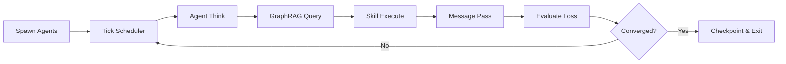





**Fractal Neural Simulation Engine**

A production-grade, self-evolving multi-agent simulation framework with recursive skill compilation, graph-based memory, and enterprise safeguards.









---

## 🏗️ The Five Engine Pillars









---

## 🚀 Quick Start

Get up and running in minutes with Docker:

```bash
# Clone and start
git clone https://github.com/nasirquant/fractal-neural-engine
cd fractal-neural-engine
docker-compose up -d

# Create your first epoch
curl -X POST http://localhost:8000/epochs \
  -H "Content-Type: application/json" \
  -d '{"num_agents": 10, "max_ticks": 100, "global_objective": "minimize_loss"}'
```


**Requires:** Python 3.11+, Redis, OpenAI API key (or Anthropic). See [Environment Variables](/docs/quickstart/#environment-variables) for full configuration.


---

## 📚 Documentation



### 5-Minute Quickstart

1. **Install dependencies**
   ```bash
   pip install -r requirements.txt
   ```

2. **Configure environment**
   ```bash
   cp .env.example .env
   # Edit .env with your OPENAI_API_KEY
   ```

3. **Start Redis**
   ```bash
   docker run -d -p 6379:6379 redis:7-alpine
   ```

4. **Run the API server**
   ```bash
   python main.py
   ```

5. **Create an epoch**
   ```bash
   curl -X POST http://localhost:8000/epochs \
     -H "Content-Type: application/json" \
     -d '{"num_agents": 10, "max_ticks": 100}'
   ```

**Next:** Explore [Architecture](/docs/architecture/) or [API Reference](/docs/api-reference/)



### System Architecture

FNSE follows a layered architecture:

| Layer | Components |
|-------|------------|
| **Client** | CLI, REST API, Python SDK |
| **Gateway** | FastAPI, WebSocket, Auth |
| **Core** | MacroSwarm, Tick Scheduler, State Manager |
| **Runtime** | 5 Agent Roles (Explorer, Optimizer, Critic, Synthesizer, Coordinator) |
| **Intelligence** | GraphRAG, SkillCompiler, LiteLLM Router |
| **Safety** | Circuit Breakers, Rollback, Alerting |
| **Persistence** | Redis Cache, Checkpoints |

See [Architecture Overview](/docs/architecture/) for detailed diagrams.



### REST API Endpoints

| Endpoint | Method | Description |
|----------|--------|-------------|
| `/epochs` | POST | Create new simulation epoch |
| `/epochs/{id}` | GET | Get epoch status |
| `/epochs/{id}/ticks` | GET | Stream tick events (WebSocket) |
| `/epochs/{id}/agents` | GET | List all agents |
| `/epochs/{id}/graph/query` | POST | Query GraphRAG |
| `/skills/compile` | POST | Compile new skill |

Full docs: [API Reference](/docs/api-reference/)



### Docker Deployment

```yaml
# docker-compose.yml
services:
  redis:
    image: redis:7-alpine
    ports: ["6379:6379"]
  
  fnse-api:
    build: .
    ports: ["8000:8000"]
    environment:
      - REDIS_URL=redis://redis:6379/0
      - OPENAI_API_KEY=${OPENAI_API_KEY}
    depends_on: [redis]
```

Production: See [Monitoring](/docs/monitoring/) for Prometheus/Grafana setup.



---

## 🔬 How It Works

### The Simulation Loop



Each epoch runs for `max_ticks` or until global loss converges below `convergence_threshold`. Agents operate in parallel, sharing knowledge through GraphRAG and evolving skills through the SkillCompiler.

---

## 🏢 Enterprise Ready










---

## 📖 Learn More












---

## 🤝 Community & Support


**Join the conversation:**
- **GitHub Discussions** — Ask questions, share ideas
- **Issues** — Bug reports and feature requests  
- **Discord** — Real-time community chat (invite in repo)








---

## 📄 License

FNSE is licensed under **AGPL-3.0** — free for commercial use, modification, and distribution. Network use requires source disclosure.

[View License](https://github.com/nasirquant/fractal-neural-engine/blob/main/LICENSE) • [Commercial Licensing](mailto:contact@fnse.dev)

---

<p align="center">
  <strong>Built with ❤️ for the future of autonomous AI systems</strong>
</p>