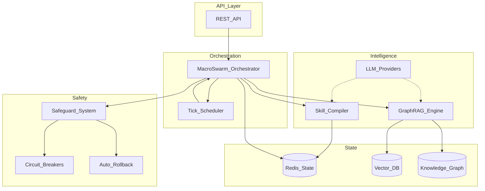

## System Overview

FNSE (Fractal Neural Simulation Engine) is a production-grade, self-evolving multi-agent simulation framework built on five core pillars:

## Core Components

### 1. MacroSwarm — Hierarchical Agent Orchestration
Manages populations of agents with specialized roles, handles tick-based execution, message passing, and cross-agent consensus.

[→ MacroSwarm Deep Dive](/docs/architecture/macroswarm/)

### 2. GraphRAG — Graph-Based Retrieval-Augmented Generation
Combines vector similarity search with knowledge graph traversal for multi-hop reasoning and episodic memory.

[→ GraphRAG Deep Dive](/docs/architecture/graphrag/)

### 3. SkillCompiler — Recursive Self-Improving Skills
Dynamic code generation, sandboxed execution, test-driven compilation, and skill versioning with dependency tracking.

[→ SkillCompiler Deep Dive](/docs/architecture/skillcompiler/)

### 4. SafeguardSystem — Enterprise Safety
Computational circuit breakers, divergence monitoring, automated state rollback, and multi-level alerting.

[→ Safeguards Deep Dive](/docs/architecture/safeguards/)

### 5. REST API — Full-Featured Server
FastAPI server with epoch lifecycle management, GraphRAG query interface, and skill compilation endpoints.

[→ API Reference](/docs/api-reference/)