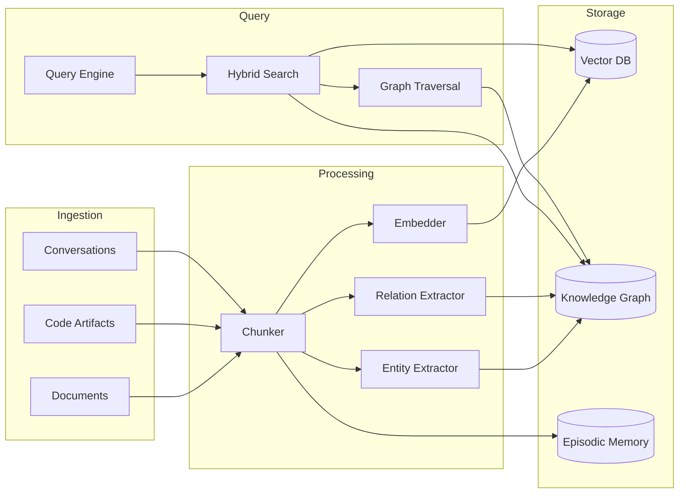

## Overview

GraphRAG combines vector similarity search with knowledge graph traversal to provide agents with contextual, multi-hop reasoning capabilities. It serves as the shared memory and knowledge substrate for the entire swarm.

## Architecture



## Components

### Vector Store

- **Backend**: Qdrant (local) or Pinecone (cloud)
- **Dimensions**: 1536 (OpenAI) or 1024 (Cohere)
- **Index**: HNSW for approximate nearest neighbor
- **Filters**: Metadata filtering by epoch, agent, type, timestamp

### Knowledge Graph

- **Backend**: Neo4j or Kuzu (embedded)
- **Nodes**: Entities (concepts, functions, variables, agents)
- **Edges**: Relations (calls, references, derives, contradicts)
- **Properties**: Confidence, source, timestamp, version

### Episodic Memory

- **Storage**: Redis Streams with TTL
- **Content**: Agent decisions, outcomes, reflections
- **Retrieval**: Temporal + semantic similarity
- **Consolidation**: Periodic graph integration

## Query Modes

### 1. Vector Similarity (Fast)

```python
results = await graphrag.vector_search(
    query="optimization strategies for neural networks",
    top_k=10,
    filters={"epoch_id": "ep_123", "type": "skill"}
)
```

### 2. Graph Traversal (Deep)

```python
results = await graphrag.graph_traverse(
    start_entity="gradient_descent",
    max_hops=3,
    relation_types=["derives", "optimizes", "combines_with"]
)
```

### 3. Hybrid (Default)

```python
results = await graphrag.hybrid_search(
    query="how to prevent catastrophic forgetting",
    vector_weight=0.6,
    graph_weight=0.4,
    max_hops=2,
    top_k=15
)
```

### 4. Multi-Hop Reasoning

```python
# Chain: query → entities → relations → connected entities → synthesis
reasoning = await graphrag.multi_hop_reason(
    question="What skills combine well with gradient_descent for sparse rewards?",
    max_hops=3,
    synthesis_model="gpt-4-turbo"
)
```

## Entity Types

| Type       | Description     | Examples                                   |
| ---------- | --------------- | ------------------------------------------ |
| `concept`  | Abstract ideas  | `gradient_descent`, `exploration_strategy` |
| `function` | Callable code   | `train_epoch`, `evaluate_loss`             |
| `variable` | State variables | `learning_rate`, `batch_size`              |
| `agent`    | Swarm agents    | `explorer_001`, `optimizer_042`            |
| `skill`    | Compiled skills | `skill_adam_optimizer_v3`                  |
| `epoch`    | Simulation runs | `ep_abc123`                                |
| `artifact` | Outputs         | `model_checkpoint_42.pt`                   |

## Relation Types

| Relation        | Direction           | Meaning                 |
| --------------- | ------------------- | ----------------------- |
| `calls`         | function → function | A invokes B             |
| `references`    | any → concept       | Mentions/uses concept   |
| `derives`       | concept → concept   | B derived from A        |
| `optimizes`     | skill → variable    | Skill tunes variable    |
| `combines_with` | skill ↔ skill       | Complementary skills    |
| `contradicts`   | concept ↔ concept   | Conflicting ideas       |
| `produced_by`   | artifact → agent    | Agent created artifact  |
| `observed_in`   | any → epoch         | Exists in epoch context |

## Configuration

```yaml
graphrag:
  vector_dim: 1536
  similarity_threshold: 0.75
  max_hops: 3
  episodic_memory_ttl_days: 30

  vector_store:
    provider: 'qdrant' # or "pinecone"
    host: 'localhost'
    port: 6333
    collection: 'fnse_vectors'

  graph_store:
    provider: 'neo4j' # or "kuzu"
    uri: 'bolt://localhost:7687'
    username: 'neo4j'
    password: '${NEO4J_PASSWORD}'
    database: 'fnse'

  embedder:
    provider: 'openai' # or "cohere", "local"
    model: 'text-embedding-3-small'
    batch_size: 100

  entity_extractor:
    model: 'gpt-4-turbo'
    confidence_threshold: 0.8

  relation_extractor:
    model: 'gpt-4-turbo'
    confidence_threshold: 0.75
```

## API Endpoints

| Method | Endpoint                            | Description            |
| ------ | ----------------------------------- | ---------------------- |
| `POST` | `/graphrag/search`                  | Hybrid search          |
| `POST` | `/graphrag/vector-search`           | Vector-only search     |
| `POST` | `/graphrag/graph-traverse`          | Graph traversal        |
| `POST` | `/graphrag/multi-hop`               | Multi-hop reasoning    |
| `POST` | `/graphrag/ingest`                  | Ingest documents       |
| `GET`  | `/graphrag/entities/{id}`           | Get entity details     |
| `GET`  | `/graphrag/entities/{id}/neighbors` | Get connected entities |

## Next Steps

- [MacroSwarm Guide](/docs/architecture/macroswarm/) — How agents use GraphRAG
- [SkillCompiler Guide](/docs/architecture/skillcompiler/) — Skills that query GraphRAG
- [API Reference](/docs/api-reference/) — Complete GraphRAG API
