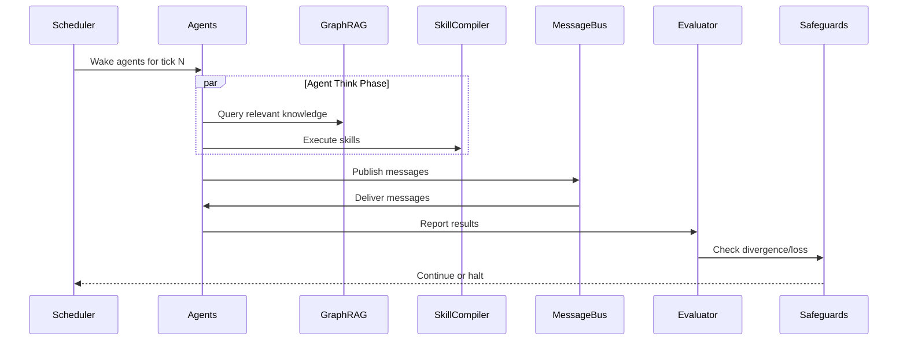

## Overview

MacroSwarm is FNSE's hierarchical agent orchestration engine. It manages populations of specialized agents that collaborate through structured message passing to achieve complex objectives.

## Agent Roles

| Role | Purpose | Typical Count |
|------|---------|---------------|
| **Explorer** | Discovers new solution spaces, generates diverse hypotheses | 30% |
| **Optimizer** | Refines promising solutions, gradient-based improvement | 25% |
| **Critic** | Evaluates solutions, identifies flaws, assigns quality scores | 20% |
| **Synthesizer** | Combines best ideas, creates hybrid solutions | 15% |
| **Coordinator** | Manages consensus, resolves conflicts, tracks global state | 10% |

## Tick-Based Execution

Each simulation epoch runs for `max_ticks` or until convergence. Each tick follows this sequence:



### Tick Phases

1. **Wake** — Scheduler activates agents based on role and priority
2. **Think** — Agents query GraphRAG, execute skills, form decisions
3. **Act** — Agents execute skills, produce outputs
4. **Communicate** — Messages published to shared bus
5. **Evaluate** — Loss computed, convergence checked
6. **Safeguard** — Circuit breakers, divergence monitoring
7. **Checkpoint** — State persisted to Redis (every N ticks)

## Message Passing

Agents communicate via typed messages on Redis-backed channels:

```python
# Message structure
{
    "message_id": "msg_abc123",
    "sender_id": "agent_exp_001",
    "recipient": "broadcast",  # or specific agent_id
    "type": "proposal",        # proposal, critique, synthesis, consensus
    "payload": {...},
    "tick": 42,
    "timestamp": "2024-01-15T10:30:00Z"
}
```

### Message Types

- **proposal** — New solution or hypothesis
- **critique** — Evaluation of another agent's proposal
- **synthesis** — Combined solution from multiple proposals
- **consensus** — Agreement on global direction
- **alert** — Safeguard-triggered warning

## Consensus Protocols

MacroSwarm supports multiple consensus mechanisms:

### Weighted Voting (Default)
Each role has a weight; Coordinator breaks ties.

### Quorum-Based
Requires N-of-M agents to agree before committing.

### Byzantine Fault Tolerant
For production deployments requiring adversarial resistance.

## Dynamic Scaling

Agents can be added/removed mid-epoch:

```python
# Scale up
await macro_swarm.scale_agents(
    role="explorer",
    delta=+5,
    reason="Exploration plateau detected"
)

# Scale down
await macro_swarm.scale_agents(
    role="optimizer",
    delta=-2,
    reason="Convergence approaching"
)
```

## Configuration

```yaml
macro_swarm:
  max_agents: 100
  min_agents: 5
  default_roles:
    - explorer
    - optimizer
    - critic
    - synthesizer
    - coordinator
  role_distribution:
    explorer: 0.30
    optimizer: 0.25
    critic: 0.20
    synthesizer: 0.15
    coordinator: 0.10
  tick_interval_ms: 100
  max_ticks: 1000
  convergence_threshold: 0.01
  checkpoint_interval_ticks: 10
  message_ttl_seconds: 300
```

## API Endpoints

| Method | Endpoint | Description |
|--------|----------|-------------|
| `GET` | `/epochs/{id}/agents` | List all agents in epoch |
| `GET` | `/epochs/{id}/agents/{agent_id}` | Get agent state |
| `POST` | `/epochs/{id}/agents/scale` | Scale agent count |
| `GET` | `/epochs/{id}/messages` | Get message history |
| `WS` | `/epochs/{id}/stream` | Real-time agent updates |

## Next Steps

- [GraphRAG Guide](/docs/architecture/graphrag/) — Knowledge retrieval for agents
- [SkillCompiler Guide](/docs/architecture/skillcompiler/) — Skills agents execute
- [Safeguards Guide](/docs/architecture/safeguards/) — Safety during execution