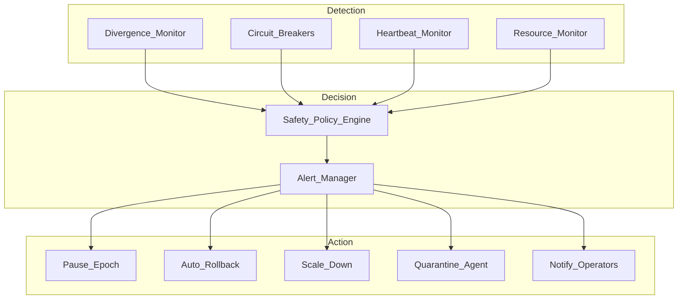

## Overview

The SafeguardSystem provides enterprise-grade safety for FNSE simulations. It continuously monitors agent behavior, detects anomalies, and automatically intervenes to prevent catastrophic failures.

## Safety Layers



## Circuit Breakers

Computational circuit breakers prevent cascade failures:

### Types

| Breaker | Trigger | Action |
|---------|---------|--------|
| **Loss Divergence** | Loss increases > threshold for N ticks | Pause epoch, alert |
| **Agent Stall** | Agent produces no output for N ticks | Quarantine agent |
| **Memory Leak** | Agent memory > threshold | Restart agent |
| **API Error Rate** | LLM API errors > threshold | Switch provider |
| **Skill Failure Rate** | Skill errors > threshold | Disable skill |

### Configuration

```yaml
safeguards:
  circuit_breakers:
    loss_divergence:
      enabled: true
      threshold: 2.0          # Loss multiplier vs baseline
      window_ticks: 10        # Consecutive ticks
      action: "pause"
      cooldown_ticks: 50
    
    agent_stall:
      enabled: true
      max_idle_ticks: 5
      action: "quarantine"
    
    memory_leak:
      enabled: true
      threshold_mb: 1024
      action: "restart"
    
    api_error_rate:
      enabled: true
      threshold: 0.5          # 50% error rate
      window_requests: 20
      action: "fallback_provider"
    
    skill_failure_rate:
      enabled: true
      threshold: 0.3          # 30% failure rate
      window_executions: 10
      action: "disable_skill"
```

## Divergence Monitoring

Tracks simulation health metrics in real-time:

```python
# Divergence metrics computed per tick
metrics = {
    "loss": 0.847,
    "loss_delta": -0.023,           # Change from previous tick
    "loss_velocity": -0.002,        # Rate of change
    "agent_diversity": 0.73,        # Solution space coverage
    "consensus_strength": 0.81,     # Agreement level
    "skill_success_rate": 0.94,     # Skill execution success
    "message_throughput": 127,      # Messages per tick
    "memory_usage_mb": 452
}

# Divergence score (0-1, higher = more divergent)
divergence_score = compute_divergence(metrics)
# Factors: loss_velocity > 0, low diversity, low consensus, low skill success
```

### Divergence Thresholds

| Level | Score | Action |
|-------|-------|--------|
| **Info** | 0.3 - 0.5 | Log, continue monitoring |
| **Warning** | 0.5 - 0.7 | Alert operators, increase checkpoint frequency |
| **Critical** | 0.7 - 0.9 | Pause epoch, prepare rollback |
| **Emergency** | > 0.9 | Immediate rollback, full halt |

## Auto Rollback

Automatically restores to last known good checkpoint:

```python
# Rollback configuration
rollback_config = RollbackConfig(
    enabled=True,
    trigger_on="critical_divergence",
    max_rollback_ticks=100,          # How far back to go
    preserve_artifacts=True,         # Keep generated skills/artifacts
    notify_on_rollback=True,
    webhook_url="https://hooks.slack.com/..."
)

# Rollback process
async def execute_rollback(epoch_id, target_tick):
    # 1. Pause all agents
    await macro_swarm.pause(epoch_id)
    
    # 2. Load checkpoint
    state = await redis.load_checkpoint(epoch_id, target_tick)
    
    # 3. Restore agent states
    await macro_swarm.restore_state(epoch_id, state)
    
    # 4. Invalidate skills created after target_tick
    await skill_compiler.invalidate_after(epoch_id, target_tick)
    
    # 5. Resume with adjusted parameters
    await macro_swarm.resume(epoch_id, 
        convergence_threshold=state.convergence_threshold * 0.5)
```

## Alerting

Multi-channel alerting with escalation:

### Channels

| Channel | Severity | Format |
|---------|----------|--------|
| **Slack** | All | Rich blocks with metrics |
| **PagerDuty** | Critical+ | Incident creation |
| **Email** | Warning+ | Summary digest |
| **Webhook** | All | JSON payload |
| **Logs** | All | Structured JSON |
### Alert Payload

```json
{
  "alert_id": "alt_abc123",
  "epoch_id": "ep_xyz789",
  "severity": "critical",
  "type": "divergence",
  "message": "Loss divergence detected: 2.3x baseline over 15 ticks",
  "metrics": {
    "loss": 4.21,
    "baseline_loss": 1.83,
    "divergence_score": 0.82
  },
  "recommended_actions": [
    "pause_epoch",
    "rollback_to_tick_85",
    "reduce_learning_rate"
  ],
  "timestamp": "2024-01-15T10:45:00Z"
}
```

## Configuration

```yaml
safeguards:
  circuit_breaker_threshold: 5
  divergence_threshold: 2.0
  rollback_on_critical: true
  alert_webhook: ""
  
  divergence:
    enabled: true
    check_interval_ticks: 1
    baseline_window_ticks: 50
    
    weights:
      loss_velocity: 0.35
      diversity: 0.20
      consensus: 0.20
      skill_success: 0.15
      throughput: 0.10
    
    thresholds:
      info: 0.3
      warning: 0.5
      critical: 0.7
      emergency: 0.9
  
  rollback:
    enabled: true
    max_lookback_ticks: 100
    min_checkpoint_interval: 5
    preserve_skills: true
    
  alerting:
    channels:
      - type: "slack"
        webhook: "${SLACK_WEBHOOK}"
        min_severity: "info"
      - type: "pagerduty"
        integration_key: "${PAGERDUTY_KEY}"
        min_severity: "critical"
      - type: "email"
        recipients: ["ops@company.com"]
        min_severity: "warning"
    
    escalation:
      warning_to_critical_minutes: 10
      critical_to_emergency_minutes: 5
```

## API Endpoints

| Method | Endpoint | Description |
|--------|----------|-------------|
| `GET` | `/epochs/{id}/safeguards/status` | Current safeguard status |
| `GET` | `/epochs/{id}/safeguards/metrics` | Divergence metrics history |
| `GET` | `/epochs/{id}/safeguards/alerts` | Alert history |
| `POST` | `/epochs/{id}/safeguards/pause` | Manually pause epoch |
| `POST` | `/epochs/{id}/safeguards/rollback` | Trigger manual rollback |
| `POST` | `/epochs/{id}/safeguards/resume` | Resume paused epoch |
| `GET` | `/safeguards/config` | Get safeguard configuration |
| `PUT` | `/safeguards/config` | Update safeguard configuration |

## Next Steps

- [MacroSwarm Guide](/docs/architecture/macroswarm/) — Agents protected by safeguards
- [SkillCompiler Guide](/docs/architecture/skillcompiler/) — Skills monitored for failures
- [API Reference](/docs/api-reference/) — Complete Safeguards API