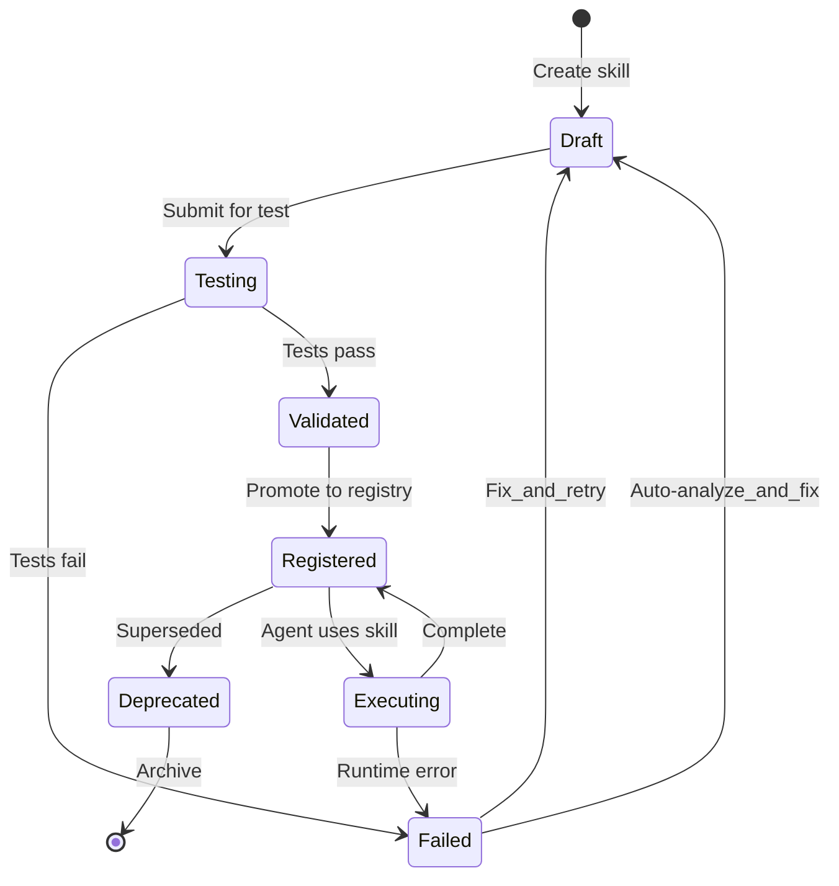
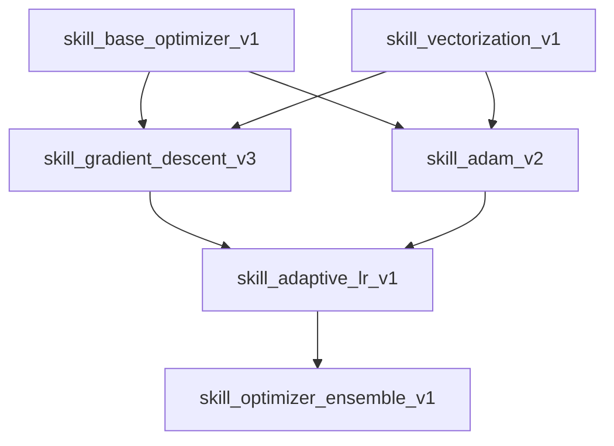

## Overview

The SkillCompiler is FNSE's recursive self-improvement engine. It analyzes agent failures, generates candidate code fixes, executes them in sandboxed environments, validates with tests, and promotes successful skills to the shared registry.

## Skill Lifecycle



## Failure Analysis

When an agent fails or produces suboptimal results, the SkillCompiler:

1. Captures context — Error trace, agent state, GraphRAG queries, inputs/outputs
2. Classifies failure — Syntax, logic, performance, hallucination, timeout
3. Retrieves patterns — Similar failures from knowledge graph
4. Generates hypotheses — Root cause candidates with confidence scores

```python
# Failure analysis output
{
    "failure_id": "fail_xyz789",
    "agent_id": "optimizer_042",
    "error_type": "performance",
    "root_causes": [
        {"hypothesis": "Inefficient loop in gradient computation", "confidence": 0.85},
        {"hypothesis": "Missing vectorization opportunity", "confidence": 0.72}
    ],
    "context": {
        "skill": "skill_gradient_descent_v2",
        "inputs": {"lr": 0.01, "batch": 32},
        "loss_before": 2.34,
        "loss_after": 2.31
    }
}
```

## Code Generation

Based on failure analysis, the compiler generates candidate fixes:

```python
# Generated skill candidate
class GradientDescentV3(Skill):
    """Vectorized gradient descent with adaptive learning rate."""
    
    def __init__(self):
        self.version = "3.0.0"
        self.dependencies = ["numpy>=1.24"]
        
    def execute(self, params: Tensor, gradients: Tensor, lr: float) -> Tensor:
        # Vectorized update with momentum
        self.momentum = 0.9 * self.momentum + lr * gradients
        return params - self.momentum
        
    def validate(self) -> bool:
        # Self-validation tests
        assert self.execute(torch.randn(10), torch.randn(10), 0.01).shape == (10,)
        return True
```

## Sandboxed Execution

All generated code runs in isolated environments:

| Sandbox | Use Case | Isolation Level |
|---------|----------|-----------------|
| **Process** | Default, fast | Process separation, resource limits |
| **Container** | Untrusted code | Docker container, no network |
| **WASM** | Portable, deterministic | WebAssembly, no syscalls |
| **Firecracker** | Maximum security | MicroVM, kernel isolation |

```python
# Sandbox configuration
sandbox_config = SandboxConfig(
    type="container",
    image="fnse/sandbox:python-3.11",
    cpu_limit="1.0",
    memory_limit="512Mi",
    timeout_seconds=30,
    network=False,
    readonly_fs=True,
    allowed_imports=["numpy", "torch", "math", "random"]
)
```

## Test-Driven Compilation

Every skill must pass generated tests before registration:

```python
# Auto-generated test suite
@pytest.mark.parametrize("input,expected", [
    ({"params": [1.0, 2.0], "grads": [0.1, 0.2], "lr": 0.01}, 
     {"params": [0.999, 1.998]}),
    ({"params": [0.0], "grads": [0.0], "lr": 0.1}, 
     {"params": [0.0]}),
])
def test_gradient_descent_v3(input, expected):
    skill = GradientDescentV3()
    result = skill.execute(**input)
    assert_allclose(result, expected["params"], rtol=1e-5)
```

## Skill Versioning

Skills follow semantic versioning with dependency tracking:

```yaml
# Skill manifest
name: gradient_descent
version: "3.1.0"
description: "Vectorized gradient descent with adaptive LR and momentum"
author: "skill_compiler"
created_at: "2024-01-15T10:30:00Z"
dependencies:
  - numpy>=1.24
  - torch>=2.0
replaces: ["gradient_descent:3.0.0"]
compatible_with: ["optimizer_role", "synthesizer_role"]
tags: ["optimization", "core", "vectorized"]
test_coverage: 0.94
performance:
  avg_latency_ms: 12
  memory_mb: 45
```

## Registry Operations

```python
# Register a new skill
skill_id = await skill_compiler.register(
    code=skill_code,
    manifest=manifest,
    test_results=test_results
)

# Get skill by ID
skill = await skill_compiler.get("skill_gradient_descent_v3")

# List skills for a role
skills = await skill_compiler.list_for_role("optimizer")

# Rollback to previous version
await skill_compiler.rollback("gradient_descent", "2.5.0")

# Deprecate a skill
await skill_compiler.deprecate("skill_old_optimizer", reason="Superseded by v3")
```

## Dependency Graph

Skills form a dependency DAG:



## Configuration

```yaml
skill_compiler:
  sandbox_timeout_seconds: 30
  max_retries: 3
  test_coverage_threshold: 0.8
  max_concurrent_compilations: 10
  
  sandbox:
    default: "container"
    fallback: "process"
    allowed_imports:
      - numpy
      - torch
      - scipy
      - sklearn
      - math
      - random
      - itertools
    blocked_imports:
      - os
      - sys
      - subprocess
      - socket
      - requests
      
  llm:
    model: "gpt-4-turbo"
    temperature: 0.3
    max_tokens: 4096
    
  versioning:
    auto_bump: "patch"
    keep_versions: 10
```

## API Endpoints

| Method | Endpoint | Description |
|--------|----------|-------------|
| POST | /epochs/{epoch_id}/skills | Compile new skill from source code |
| GET | /epochs/{epoch_id}/skills | List skills for an epoch |
| GET | /epochs/{epoch_id}/skills/{skill_id} | Get skill details |

## Next Steps

- [MacroSwarm Guide](/docs/architecture/macroswarm/) — Agents that use skills
- [GraphRAG Guide](/docs/architecture/graphrag/) — Knowledge for skill generation
- [Safeguards Guide](/docs/architecture/safeguards/) — Safety during skill execution